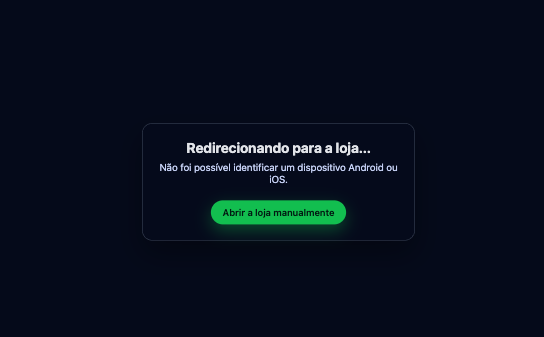

# 📱 Automatic Redirect Page — Play Store / App Store



A lightweight, fully static HTML page that detects the visitor’s device operating system and automatically redirects them to the appropriate app store.  
Perfect for marketing campaigns, QR codes, and download links where simplicity and speed matter.

🔗 **Live Demo (GitHub Pages):**  
https://philipe-vieira.github.io/redirect-page/

📄 **Read this README in Portuguese:**  
[README-ptbr.md](README-ptbr.md)

---

## 🎯 Purpose

This project simplifies how users access your mobile application by automatically sending each device to the correct store:

- Android → Google Play  
- iOS → App Store  
- Unsupported or desktop → Shows an informational message instead of redirecting

All of this works with pure HTML, CSS, and JavaScript, without any backend.

---

## 🚀 How It Works

The script analyzes the browser’s `userAgent` to detect:

- Android devices  
- iOS devices (including iPadOS devices that identify as macOS but support touch)  
- Any other environments  

Once detected, the page displays a status message and redirects the user to the correct store.  
A fallback button is displayed in case automatic redirection fails.

---

## 🛠️ Setup

Inside `index.html`, update these two constants with your actual app links:

```js
const ANDROID_APP_URL =
  "ttps://play.google.com/store/apps/details?id=com.android.chrome&pcampaignid=web_share";

const IOS_APP_URL =
  "https://apps.apple.com/br/app/google-chrome/id535886823";
